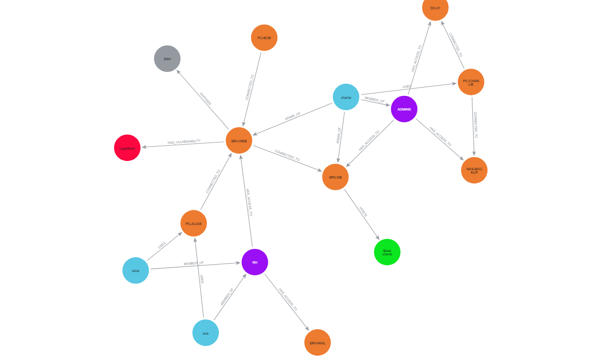

# Livrable 3 — Rapport d'analyse cyber
## CyberCorp — Cartographie du SI et analyse des chemins d'attaque

---

## 1. Présentation du système d'information modélisé

CyberCorp est une entreprise fictive dont le SI a été modélisé sous forme de graphe Neo4j. Il est composé de 35 nœuds et 55 relations répartis comme suit :

| Type | Éléments |
|---|---|
| Utilisateurs | alice (RH), bob (Développeur), charlie (Admin), diana (RSSI), eve (Stagiaire) |
| Machines | PC-ALICE, PC-BOB, PC-CHARLIE, SRV-WEB, SRV-MAIL, SRV-DB, DC-01, NAS-BACKUP |
| Services | SSH, HTTP, HTTPS, RDP, SMB, MongoDB, SMTP |
| Vulnérabilités | Log4Shell, Zerologon, BlueKeep, Spring4Shell, ProxyLogon, SMB Misconfig |
| Groupes | RH, DEV, ADMINS, SECURITY |
| Ressources | Base clients, Données RH, Active Directory, Sauvegardes, Secrets applicatifs |

Le réseau est organisé en trois zones logiques non segmentées : zone utilisateurs (PC-ALICE, PC-BOB, PC-CHARLIE), zone DMZ (SRV-WEB, SRV-MAIL) et zone critique (SRV-DB, DC-01, NAS-BACKUP).

---

## 2. Schéma ou capture du graphe



---

## 3. Hypothèse d'attaque

Une alerte de sécurité indique qu'un poste utilisateur a été compromis à la suite d'une attaque par **phishing**.

| Élément | Détail |
|---|---|
| Machine compromise | PC-ALICE (192.168.1.10) |
| Utilisateurs exposés | alice (RH) et eve (Stagiaire) — poste partagé |
| Vecteur d'attaque | E-mail de phishing ciblant alice |
| Objectif de l'attaquant | Atteindre les ressources critiques du SI |

PC-ALICE est un point d'entrée dangereux car la machine est directement connectée à SRV-WEB et SRV-MAIL, et alice appartient au groupe RH qui dispose d'un accès à ces deux serveurs.

---

## 4. Chemins d'attaque identifiés

### Chemin 1 — Route principale vers DC-01 (3 sauts)

```
PC-ALICE → SRV-WEB → SRV-DB → DC-01
```

Requête Cypher utilisée :
```cypher
MATCH path = shortestPath(
  (start:Machine {name: "PC-ALICE"})-[:CONNECTED_TO*]->(target:Machine {name: "DC-01"})
)
RETURN [node IN nodes(path) | node.name] AS chemin, length(path) AS nb_sauts;
```

- **PC-ALICE → SRV-WEB** : connexion réseau directe. SRV-WEB est vulnérable à Log4Shell (CVSS 10.0), permettant une exécution de code à distance.
- **SRV-WEB → SRV-DB** : SRV-DB héberge la Base clients et les Secrets applicatifs.
- **SRV-DB → DC-01** : DC-01 est vulnérable à Zerologon (CVSS 10.0), permettant une prise de contrôle totale de l'Active Directory.

### Chemin 2 — Route alternative via SRV-MAIL (3 sauts)

```
PC-ALICE → SRV-MAIL → SRV-DB → DC-01
```

SRV-MAIL est vulnérable à ProxyLogon (CVSS 9.8). Ce chemin alternatif montre que bloquer uniquement SRV-WEB ne suffit pas.

### Chemin 3 — Vers NAS-BACKUP, scénario ransomware (3 sauts)

```
PC-ALICE → SRV-WEB → SRV-DB → NAS-BACKUP
```

NAS-BACKUP héberge les Sauvegardes et est vulnérable à une mauvaise configuration SMB. Un attaquant peut détruire les sauvegardes avant de déployer un ransomware, rendant toute restauration impossible.

---

## 5. Machines vulnérables

| Machine | Criticité | CVE | Vulnérabilité | CVSS | Score risque |
|---|---|---|---|---|---|
| DC-01 | critical | CVE-2020-1472 | Zerologon | 10.0 | **32.5** |
| NAS-BACKUP | critical | CVE-2023-0001 | SMB Misconfig | 7.5 | **25.0** |
| SRV-WEB | medium | CVE-2021-44228 | Log4Shell | 10.0 | **17.5** |
| SRV-MAIL | medium | CVE-2021-26855 | ProxyLogon | 9.8 | **17.2** |
| PC-BOB | medium | CVE-2019-0708 | BlueKeep | 9.8 | **17.2** |
| SRV-DB | high | — | Aucune CVE | — | 2.5 |

> Score risque = score CVSS × multiplicateur criticité (×3 critical / ×2 high / ×1.5 medium) + pénalité non patché (+2.5)

DC-01 est la machine la plus dangereuse du SI : criticité maximale, Zerologon non corrigé, et directement accessible depuis SRV-DB.

---

## 6. Services exposés

| Machine | Service | Port | Risque |
|---|---|---|---|
| SRV-WEB | HTTP / HTTPS | 80 / 443 | Surface web exposée, vulnérable à Log4Shell et Spring4Shell |
| SRV-WEB | SSH | 22 | Accès shell si clés compromises |
| SRV-MAIL | SMTP / HTTPS | 25 / 443 | Vecteur de phishing sortant, interface Exchange exposée |
| SRV-DB | MongoDB | 27017 | Base de données accessible depuis le réseau sans authentification |
| SRV-DB | SSH | 22 | Accès shell au serveur de base de données |
| DC-01 | SMB | 445 | Exploité par Zerologon et les attaques de mouvement latéral |
| DC-01 | RDP | 3389 | Accès graphique distant au contrôleur de domaine |
| NAS-BACKUP | SMB | 445 | Partages de sauvegarde accessibles en réseau |
| PC-BOB | RDP | 3389 | Poste vulnérable à BlueKeep |

Les services les plus critiques sont MongoDB exposé sans authentification sur SRV-DB et SMB sur DC-01, qui est le vecteur d'exploitation de Zerologon.

---

## 7. Utilisateurs et groupes à risque

### Utilisateurs

| Utilisateur | Risque | Raison |
|---|---|---|
| alice | Élevé | Victime du phishing, appartient au groupe RH avec accès à SRV-WEB et SRV-MAIL |
| eve | Élevé | Partage PC-ALICE avec alice — compromise indirectement |
| charlie | Critique | Seul administrateur système avec droits sur DC-01, NAS-BACKUP, SRV-DB, SRV-WEB, SRV-MAIL |
| bob | Moyen | Accès à SRV-DB via le groupe DEV — violation du moindre privilège |

### Groupes

| Groupe | Problème |
|---|---|
| RH | alice et eve partagent le même poste. Un phishing sur l'une expose les deux comptes. |
| DEV | bob accède directement à SRV-DB en production. Accès non justifié fonctionnellement. |
| ADMINS | charlie est le seul membre. Point de défaillance unique (SPOF) sur toute l'infrastructure. |

---

## 8. Recommandations de sécurité

### Priorité 1 — Immédiat (< 24h)
- **Isoler PC-ALICE** du réseau et réinitialiser les comptes alice et eve.
- **Patcher DC-01** contre Zerologon (CVE-2020-1472, CVSS 10) — appliquer KB4569742.

### Priorité 2 — Court terme (< 1 semaine)
- **Corriger Log4Shell** sur SRV-WEB (CVE-2021-44228) — mettre à jour Log4j >= 2.15.0.
- **Patcher ProxyLogon** sur SRV-MAIL (CVE-2021-26855) — appliquer KB5001779.
- **Activer l'authentification MongoDB** sur SRV-DB et désactiver les accès anonymes.

### Priorité 3 — Refonte architecture (< 1 mois)
- **Segmenter le réseau** en VLANs : Zone utilisateurs / DMZ / Serveurs / Critique. Les postes utilisateurs ne doivent jamais atteindre DC-01 directement.
- **Supprimer l'accès DEV → SRV-DB** : appliquer le principe du moindre privilège.
- **Séparer les postes** d'alice et d'eve : ne plus partager PC-ALICE.
- **Déployer MFA** sur tous les comptes administrateurs.
- **Mettre en place un bastion** pour l'accès à DC-01 — supprimer RDP exposé directement.
- **Sauvegardes hors ligne** : les sauvegardes NAS-BACKUP doivent être immuables ou déconnectées du réseau principal.

---

## 9. Conclusion

L'analyse du graphe CyberCorp met en évidence trois problèmes majeurs.

Premièrement, **l'absence de segmentation réseau** permet d'atteindre DC-01 en seulement 3 sauts depuis un simple poste utilisateur compromis par phishing. Dans un SI correctement cloisonné, ce chemin ne devrait pas exister.

Deuxièmement, **deux vulnérabilités de score CVSS 10 non corrigées** — Log4Shell sur SRV-WEB et Zerologon sur DC-01 — forment une chaîne d'attaque triviale vers l'Active Directory. La compromission de DC-01 entraîne la prise de contrôle complète du SI.

Troisièmement, **la concentration des droits d'administration** sur le seul compte charlie constitue un point de défaillance unique. Sa compromission suffit à donner un accès total à l'ensemble de l'infrastructure critique.

Neo4j s'est révélé particulièrement adapté à cette analyse : les requêtes `shortestPath()` et la traversée de relations `CONNECTED_TO` permettent de simuler précisément les mouvements latéraux d'un attaquant, ce qui serait complexe à exprimer avec une base de données relationnelle classique.